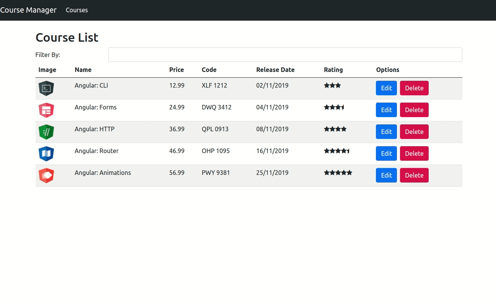

<p align="center">
  
</p>

<p align="center">
  

  

  

  

  <a href="./LICENSE.md">
    
  </a>
</p>

<br>

<p align="center">
  
</p>

# Índice
[Sobre](#ℹ️-sobre)<br>
[Como rodar o projeto](#⚙️-como-rodar-o-projeto)<br>
[Tecnologias](#🛠-tecnologias)<br>
[Autora](#👩‍💼-autora)

<br>

# ℹ️ Sobre

Projeto desenvolvido no estudo dos conceitos básicos do framework Angular 8 no BootCamp FullStack Santander.

Para o ensinamento dos conhecimentos básicos foi desenvolvida uma aplicação de gerenciamento de cursos, contendo a página principal e uma página com as informações de cada curso.

O back-end da aplicação foi disponibilizado na pasta `server`.

<br>

# ⚙️ Como rodar o projeto

```bash
# Clone o repositório
$ git clone https://github.com/nlnadialigia/course-manager.git
```

### 📌 Back end
```bash
# Entre na pasta server
$ cd server

# Instale as dependências
$ yarn

# Execute a aplicação
$ yarn start
```

### 📌 Front end
```bash
# Entre no repositório
$ cd course-manager

# Instale as dependências
$ yarn

# Execute a aplicação
$ yarn start
```
### 📌 Acessar a aplicação
- com o back end rodando, acesse o browser no endereço `http://localhost:4200/`

<br>

# 🛠 Tecnologias

- [Angular](https://angular.io/)
- [Bootstrap](https://getbootstrap.com/)
- [Typescript](https://www.typescriptlang.org/)
- [Nodejs](https://nodejs.org/)

<br>

# 👩‍💼 Autora

<p><b>Nádia Ligia, desenvolvedora em construção.</b></p>
<a href="https://www.linkedin.com/in/nlnadialigia/">
  
</a>&nbsp;
<a href="mailto:nlnadialigia@gmail.com">
  
</a>&nbsp;
<a href="https://www.nlnadialigia.com">
  
</a>
